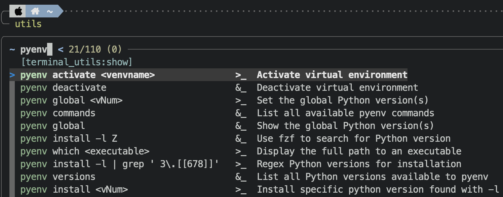

# zsh-utils

Fuzzy find, copy, paste, and execute platform, switch, and git specific commands from and to your command line easy and fast.



- **\*utils**
    - Custom CLI fuzzy utils to execute or copy common commands
- **cheat\***
    - Custom CLI fuzzy cheatsheets
- **bi, bu, ci, cu**
    - Homebrew: Install and uninstall formulas and casks using fuzzy completion

Use the copy script to copy from or to the repository folder. Use git to merge.

## Installation

### Pre-requirements: 
https://github.com/junegunn/fzf    
https://sourceforge.net/projects/xclip/ on Linux

e.g.: Ubuntu/Debian
```
cd
sudo apt install xclip zsh git
chsh -s $(which zsh)
git clone --depth 1 https://github.com/junegunn/fzf.git ~/.fzf
~/.fzf/install
```

### Autoload function definition
1. Add the following to your `~/.zshrc`:

```
# Set autoload FPATH.
fpath=(~/.zshutils "${fpath[@]}")
# Autoload zsh-utils
autoload -Uz utils gitutils #... and more, choose by yourself
```

2. Clone this repository
```
# SSH
git@github.com:theuema/dotfiles.git
# HTTPS
https://github.com/theuema/dotfiles.git
```

4. Copy utils to autoload path manually

e.g.: `rsync -ahP zshutils/utils ~/.zshutils`

<details>
  <summary>TODO: copy script</summary>
    Execute `./copy.sh`:
    |Command|Action|
    |--|--|
    |`./copy.sh -import`| Copy utils from the repository folder to the autoload path `~/.zshutils`|
</details>

5. Source, fuzzy find hostname command and print your hostname

Source zsh: `source ~/.zshrc`    
Type: `utils` Hit: `<Enter>`    
Fuzzy find `hostname` Hit: `<Enter>`

### Optional

#### Oh My Zsh config & theming 
https://github.com/ohmyzsh/ohmyzsh

```
sh -c "$(curl -fsSL https://raw.githubusercontent.com/ohmyzsh/ohmyzsh/master/tools/install.sh)"
```

For theming just change `ZSH_THEME=YOURTHEME`. 
Find available themes at https://github.com/ohmyzsh/ohmyzsh/wiki/Themes

#### Fzf, ripgrep & new defaults
https://github.com/BurntSushi/ripgrep

e.g.: Ubuntu/Debian
```
sudo apt install ripgrep
```

Add the following to your `~/.zshrc`
```
# fzf does not use ripgrep by default, so we need to tell fzf to use ripgrep with FZF_DEFAULT_COMMAND variable.
# Pay attention to -m in FZF_DEFAULT_OPTS. This option allows us to make multiple selections (with Tab or Shift-Tab).
if type rg &> /dev/null; then
  export FZF_DEFAULT_COMMAND="rg --files"
  export FZF_DEFAULT_OPTS="
  --multi
  --border
  --height=60%
  --layout=reverse
  --info inline
  --prompt='∼ '
  --ansi
  --color='pointer:032,marker:010,bg+:237,gutter:008'
  --bind 'ctrl-a:select-all'
  --preview-window=:hidden
  --bind '?:toggle-preview'
  --preview '([[ -f {} ]] && (bat --style=numbers --color=always {} || cat {})) || ([[ -d {} ]] && (tree -C {} | less)) || echo {} 2> /dev/null | head -200'
  --bind 'ctrl-e:execute(echo {+} | xargs -o vim)'
  "
fi
```

#### Keybinding

Enable the following line in your `~/.zshrc`:

`bindkey -s '^u' 'utils\n'` to bind "Ctrl+u" to utils.

<br>